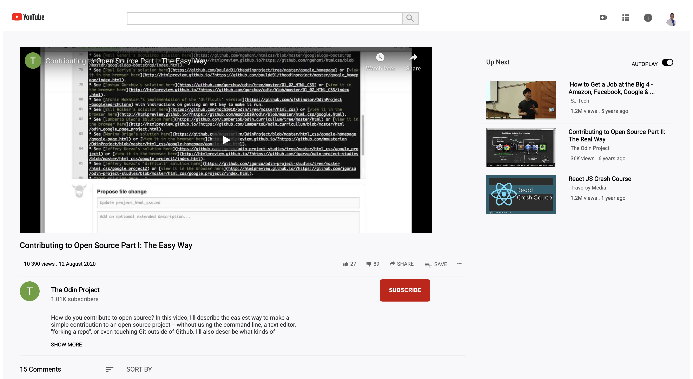

# Embedding Images and Videos: YouTube Clone Microverse HTML/CSS Project

> This is a microverse student project for embedding images and videos . 


> This project clones the youtube interface design.
> We implement three core features of the yourtube interface as listed below.
- # Navigation bar
    - It has an embedded image that represents a logo.
    - The logo is aligned to the leftmost part of the navbar.
    - It has an input tag that represents a search bar.
    - The search bar is aligned to the middle of the navbar. 
    - It has a button tag that represents the search button.
    - The search button is at the end (rightmost part) of the search bar.
    - It has at least three embedded images on the rightmost part of the navbar that represent icons and/or an avatar.
- # Video
    - It is displayed.
    - It shows the video title.
    - It shows the number of views.
    - It has like and dislike icons.
    - It has a share button.
    - It shows the avatar of the user who uploaded the video.
    - It has a subscribe button.
- # Sidebar Recommended videos

    - It shows the recommended video’s thumbnail preview (as image not as an actual video).
    - It shows the title of the video.
    - It shows the number of views.

## Built With

- HTML
- CSS

## Live Demo

[Live Demo Link](https://livedemo.com)

## Getting Started

 To get a local copy up and running follow these simple example steps.

### Prerequisites
> Browser
> Text editor of your choice
> npm has to be installed in your system

### Setup
> ``` git clone https://github.com/BigWizzo/youtube-clone.git ```

### Usage
> Open the index.html from your browser.

### Run tests
Run ``` npx html-validator-cli --quiet --file index.html ``` to run the validator over the ```index.html``` file.

The ```--quiet``` will only list ```errors```. If you also want to see the warnings use the ```--verbose``` flag instead.
As an alternative, you can also install the ```html5validator``` using ```pip```:

``` 
pip install --user html5validator
html5validator index.html 
```


